<a href="https://sahandulanjaya.com">
  
</a>

<br />


### I break things on purpose, so your users never break them by accident.

I'm a QA Engineer from Matugama, Sri Lanka, with nearly 3 years of manual and automated testing behind me. I like owning quality from the very first requirement to the final release: reading requirements closely to catch the gaps, ambiguities and edge cases before they reach development, then digging in with exploratory, functional and regression testing until the real root cause shows up.

The bugs I hunt range from quiet business-logic defects in payment and settlement flows to authentication and security holes. I build automation with Playwright, Selenium, TestNG and Java, test APIs with Postman, bring AI into every step from test design to defect reports, and build my own custom tools whenever repetitive work starts slowing a test cycle down.

Outside the day job I build things too: web apps on Cloudflare Workers, browser games, automated content sites and frontends for Web3 projects, plus the social content and videos that help them launch.

```text
now        QA Engineer at DevUpLink
certified  ISTQB CTFL v4.0 · Playwright JS/TS · Selenium WebDriver with Java
published  FireWatch: LoRa-based wildfire detection (IEEE, ICATC 2024)
into       crypto, Web3, and test suites people can actually trust
based in   Matugama, Sri Lanka
```

<br />


<p align="center">
  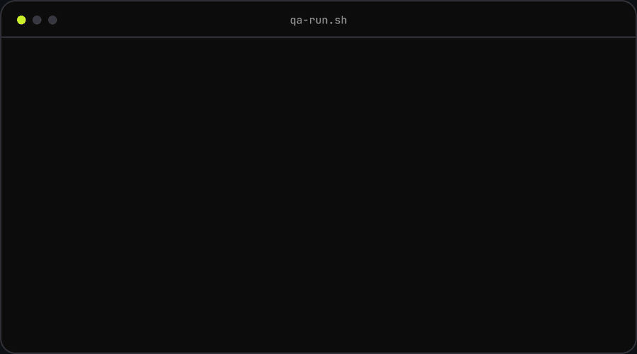
</p>

<p align="center"><sub><i>Catch it, prove it, report it, rerun it green. That's the job, and I love it.</i></sub></p>

<br />


<table>
  <tr>
    <td width="50%" valign="top">
      <a href="https://sahandulanjaya.com/portfolio-archive/anon-mail/">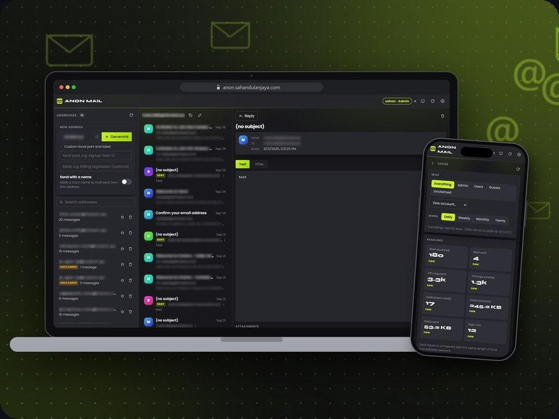</a>
      <h3>Anon Mail</h3>
      Disposable catch-all inboxes I built for testing sign-ups, resets and one-time codes, with roles, limits and a usage dashboard.
      <br /><br /><code>Cloudflare Workers</code> <code>D1</code> <code>Email Routing</code> <code>Resend</code> <code>Vite</code>
    </td>
    <td width="50%" valign="top">
      <a href="https://sahandulanjaya.com/portfolio-archive/orbitdex/">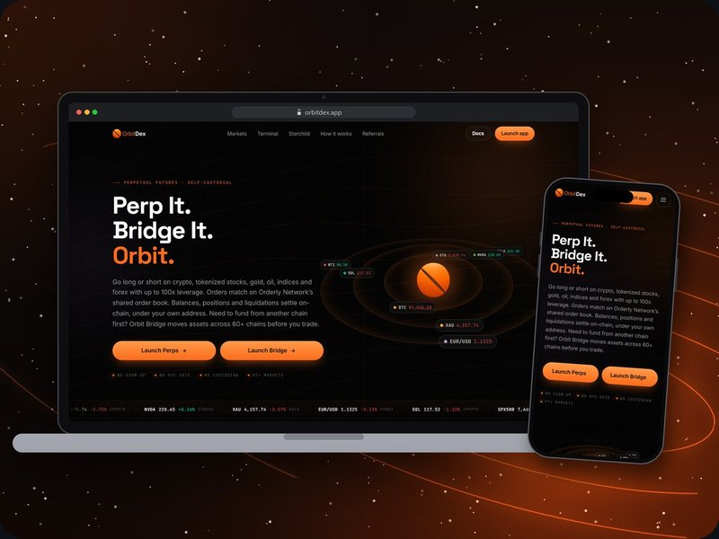</a>
      <h3>OrbitDEX</h3>
      Frontend for a self-custodial perpetual futures exchange: a full trading terminal for crypto, stocks, gold and forex. Team project.
      <br /><br /><code>React</code> <code>Vite</code> <code>Orderly Network</code> <code>LI.FI</code> <code>TradingView</code>
    </td>
  </tr>
  <tr>
    <td width="50%" valign="top">
      <a href="https://sahandulanjaya.com/portfolio-archive/pulse-guy/">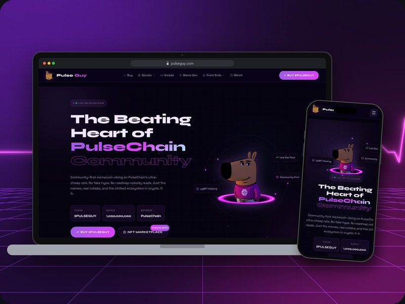</a>
      <h3>Pulse Guy</h3>
      A PulseChain meme that grew into a whole ecosystem. I've built both of its sites and made its social content and videos since day one.
      <br /><br /><code>WordPress</code> <code>Elementor</code> <code>JavaScript</code> <code>PHP</code> <code>MySQL</code>
    </td>
    <td width="50%" valign="top">
      <a href="https://sahandulanjaya.com/portfolio-archive/just-a-flappy-pulse-guy/">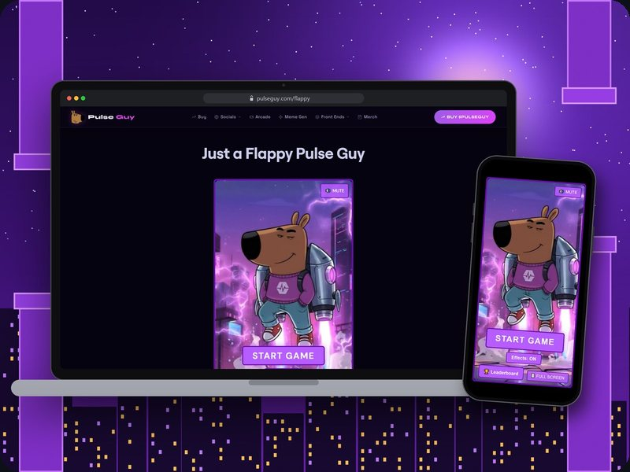</a>
      <h3>Just a Flappy Pulse Guy</h3>
      A Flappy-style browser game with a cheat-resistant leaderboard: single-use play tokens, timing checks and rate limits.
      <br /><br /><code>JavaScript</code> <code>PHP</code> <code>MySQL</code> <a href="https://sahandulanjaya.com/portfolio-archive/just-a-flappy-pulse-guy/"><b>Play it</b></a>
    </td>
  </tr>
  <tr>
    <td width="50%" valign="top">
      <a href="https://sahandulanjaya.com/portfolio-archive/tiny-space-diy/">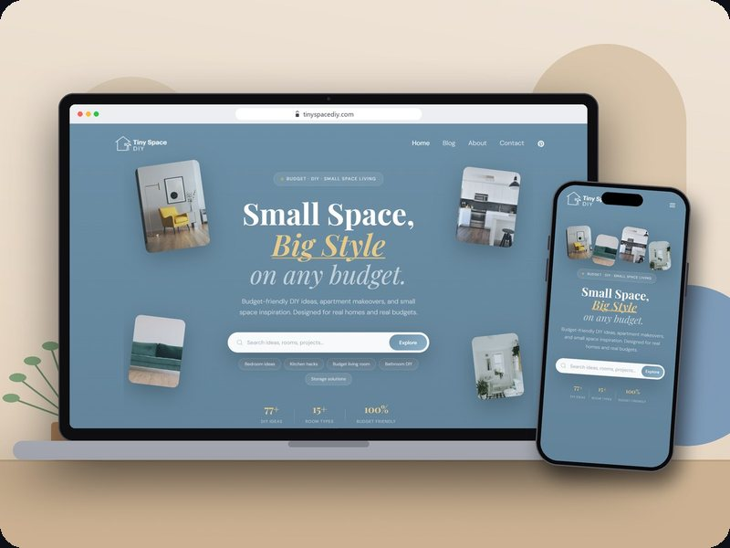</a>
      <h3>Tiny Space DIY</h3>
      My attempt at a fully automated blog for small-space living, with an n8n pipeline from topic to Pinterest in progress.
      <br /><br /><code>WordPress</code> <code>Astra</code> <code>Claude</code> <code>Ideogram</code> <code>n8n</code>
    </td>
    <td width="50%" valign="top">
      <a href="https://sahandulanjaya.com/portfolio-archive/xbridge-gold/">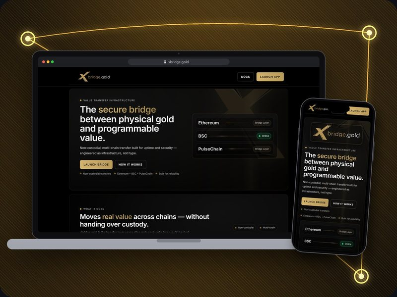</a>
      <h3>xBridge Gold</h3>
      Frontend for a cross-chain bridge in a gold-backed ecosystem, built around the client's own brand, idea and colours.
      <br /><br /><code>WordPress</code> <code>Elementor</code>
    </td>
  </tr>
</table>

<p align="center"><a href="https://sahandulanjaya.com/#cases"><b>See every project on sahandulanjaya.com</b></a></p>

<br />



<br />



<br />


Got a product that needs a second pair of very picky eyes, or a site that should feel as solid as it looks? I'd love to hear about it.

<p>
  <a href="https://sahandulanjaya.com"></a>&nbsp;
  <a href="https://www.linkedin.com/in/sahan-dulanjaya"></a>&nbsp;
  <a href="mailto:sahandulanjaya99@gmail.com"></a>&nbsp;
  <a href="https://www.instagram.com/_d.u.l.a_/"></a>
</p>

<br />

<a href="https://sahandulanjaya.com">
  
</a>

<p align="center">
  
</p>
